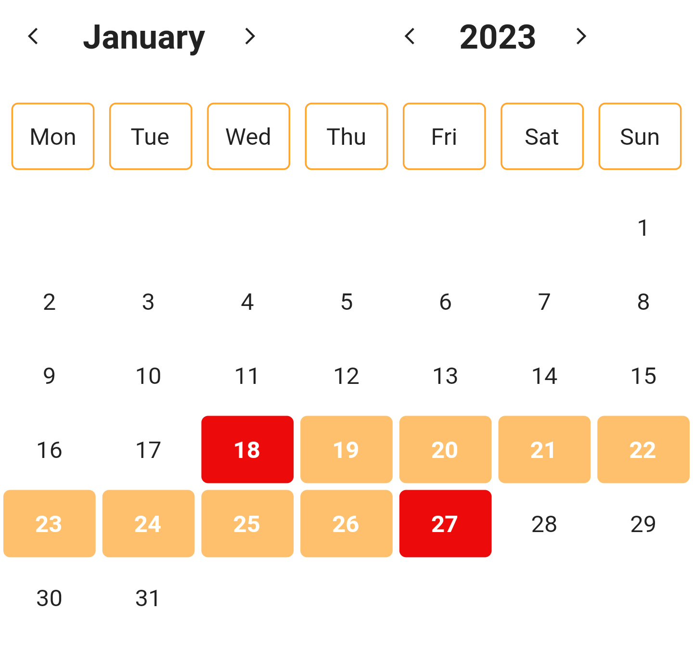
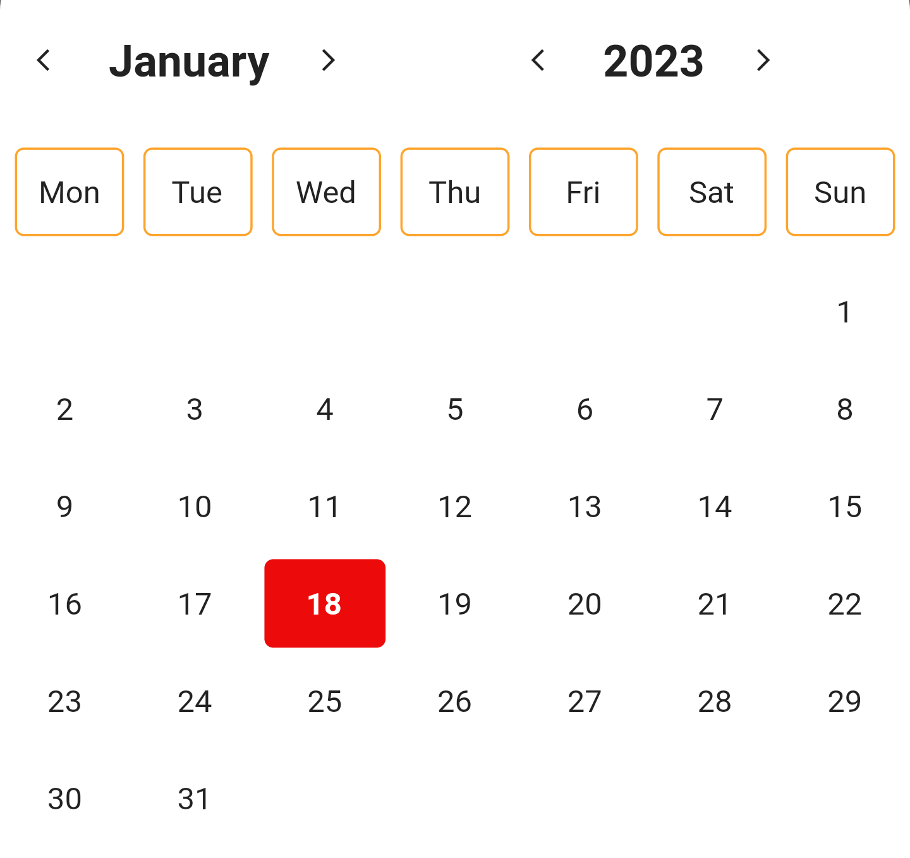
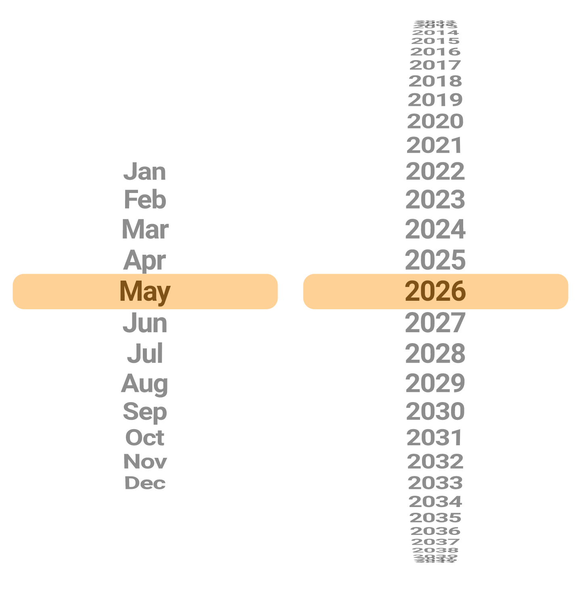
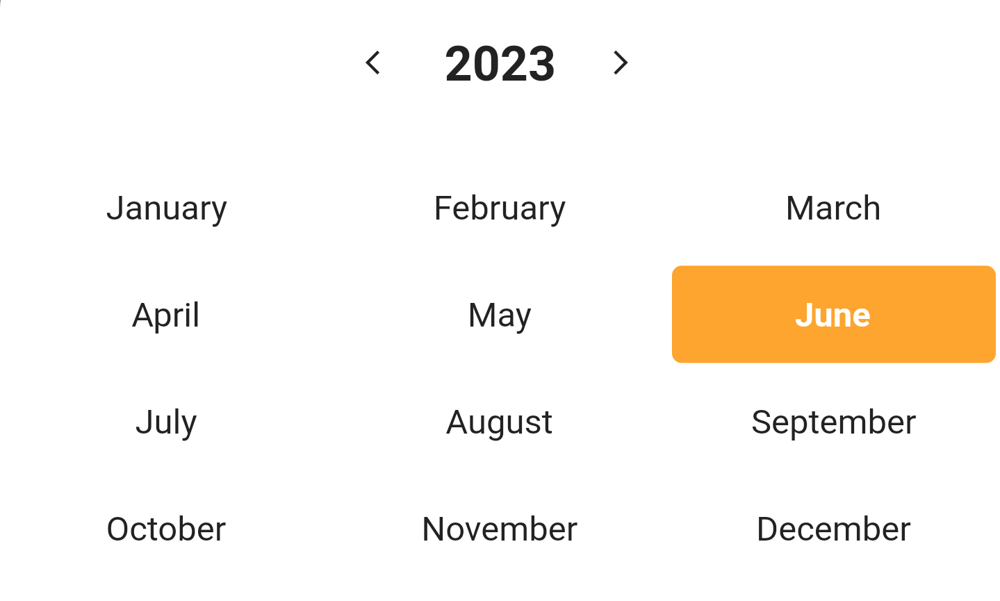
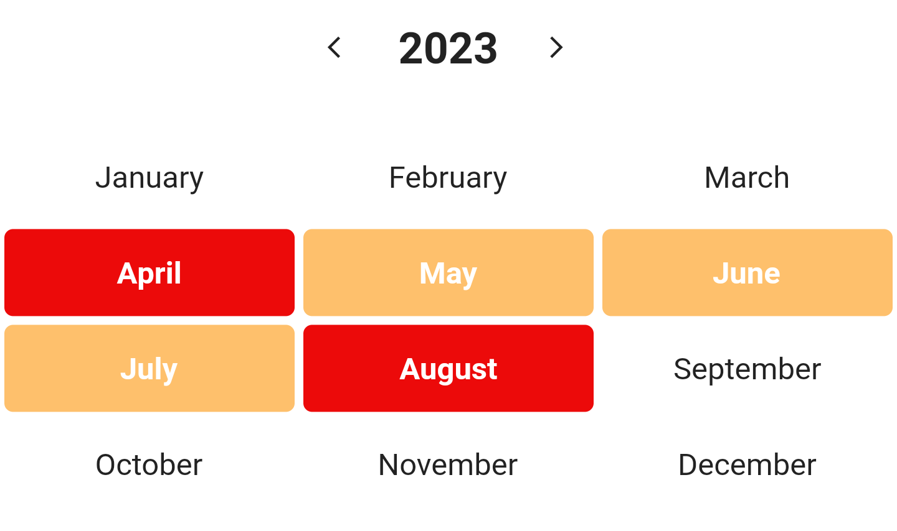

<!-- 
This README describes the package. If you publish this package to pub.dev,
this README's contents appear on the landing page for your package.

For information about how to write a good package README, see the guide for
[writing package pages](https://dart.dev/guides/libraries/writing-package-pages). 

For general information about developing packages, see the Dart guide for
[creating packages](https://dart.dev/guides/libraries/create-library-packages)
and the Flutter guide for
[developing packages and plugins](https://flutter.dev/developing-packages). 
-->


## Mobkit Date Picker

The Mobkit Date Picker is a lightweight widget that allows users to easily select a single date, multiple dates, or a range of dates. It supports minimum, maximum, blackout and disabled dates to restrict date selection.

## Getting started

##### Import the following package.

```dart
flutter pub add -d mobkit_date_picker
```

```dart
import 'package:mobkit_date_picker/mobkit_date_picker.dart';
```
##### Mobkit Date Picker Types

The `MobkitDatePicker` widget provides two different types of views to display. With `StandardCalendar` you can have a standard date picker view, just use `MonthAndYearCalendar` for month and year selection


##### Add mobkit date picker to the widget tree.

Add the `StandardCalendar / MonthAndYearCalendar` widget as a child of any widget. Here, widget is added as a child of the scaffold widget.


`StandardCalendar`
```dart
@override
Widget build(BuildContext context) {
  return Scaffold(
      body: Container(
    child: StandardCalendar(
      calendarDate: DateTime.now(),
      onSelectionChange: (value) {},
      onRangeSelectionChange: (firstDate, lastDate) {},
    ),
  ));
}
```

`MonthAndYearCalendar`
```dart
@override
Widget build(BuildContext context) {
  return Scaffold(
      body: Container(
    child: MonthAndYearCalendar(
      calendarDate: DateTime.now(),
      onSelectionChange: (value) {},
      onRangeSelectionChange: (firstDate, lastDate) {},
    ),
  ));
}
```

##### StandardCalendar

`StandardCalendar` gives a standard view of selecting dates. You can use `StandardCalendar` if you want the user to select a single date or a date range with multiple recipes.

You can customize your date picker with `StandardCalendarConfigModel`.
##### StandardCalendarSelectionType
You must decide whether you want the user to have a single date or a range of dates with multiple dates.
* `rangeTap`
rangeTap expects the user to select a date range with multiple dates. When the user clicks on two different dates, the dates between the two clicked dates are returned.


* `singleTap`
singleTap expects the user to select a single date. When the user clicks on any date, it returns that date as a result.



##### MonthAndYearCalendar
MonthAndYearCalendar provides a view that allows the user to select month and year. You can use MonthAndYearCalendar if you want the user to select a date range that includes a single month or multiple months.

You can customize your date picker with `MonthAndYearCalendarConfigModel`.

##### MonthAndYearCalendarSelectionType
You must decide whether you want the user to have a single date or a range of dates with multiple dates.
* `selectionScroll`
selectionScroll allows the user to select a single month and year. The user can select the month and year by swiping his finger up and down.


* `selectionSingle`
selectionSingle allows the user to select a single month and year. The user can make his selection by clicking on one of the months listed on the screen.


* `selectionRange`
selectionRange allows the user to select multiple months. When the user clicks on two of the months listed on the screen, the dates between the two dates they clicked on are returned as the response.



##### Get Value

MobkitDatePicker provides two methods when retrieving date or date range from user.

* `onSelectionChange`
If you want the user to select a single date, you can get the date selected by the user with the `onSelectionChange` function.

    ```dart
    onSelectionChange: (value) {
            selectedDate = value;
        },
    ```

* `onRangeSelectionChange`
If you want the user to select more than one date, you can get the first and last date of the date range selected by the user with the `onRangeSelectionChange` function.
    ```dart
    onRangeSelectionChange: (firstDate, lastDate) {
            selectedDate = value;
        },
    ```

##### Change Different Views

*   StandardCalendarConfigModel
    * `String? title` - The title you want to appear at the top of the date picker.

    * `String? locale` - It determines in which locale the date picker will work.

    * `bool showAllDays` - Whether the date picker will show all days

    * `bool disableOffDays` - Turns off all dates of the date picker

    * `bool disableWeekendsDays` - Whether to show the bar showing the days of the week above the date picker

    * `StandardCalendarSelectionType selectionType` - Specifies the date picker type of the date picker.

    * `PickerType pickerType` - Specifies what type of date the date picker will select.

    * `DateTime? disableBefore` - The date picker closes before the specified date.

    * `DateTime? disableAfter` - The date picker closes after the specified date.

    * `List<DateTime>? disabledDates` - Specifies which types the date picker will turn off.

    * `EdgeInsetsGeometry itemSpace` - Space inside the cells of the date picker

    * `Duration animationDuration` - Animation Duration

    * `Color enabledColor` - The color that the active days of the date picker will have

    * `Color disabledColor` - The color that the inactive days of the date picker will have

    * `Color selectedColor` - The color that the selected days of the date picker will have

    * `Color isFirstLastItemColor` - If you are selecting a range with your date picker, the color of the first and last element of the range

    * `Color primaryColor` - The main theme color of your date picker

    * `Color enabledBorderColor` - The color of the borders of the active days of the date picker

    * `Color disabledBorderColor` - The color of the borders of the inactive days of the date picker

    * `Color selectedBorderColor` - The color of the borders of the selected days of the date picker

    * `double borderWidth` - The width of the date picker's borders.

    * `BorderRadiusGeometry borderRadius` - If non-null, the corners of this box are rounded.

    * `TextStyle enableStyle` - The textstyle that the active days of the date picker will have

    * `TextStyle monthDaysStyle` - The textstyle that the days of the month will have in the date picker.

    * `TextStyle weekDaysStyle` - The textstyle that the days of the week will have in the date picker

    * `TextStyle disabledStyle` - The textstyle that the inactive days of the date picker will have

    * `TextStyle currentStyle` - The textstyle that today's date will have

    * `TextStyle selectedStyle` - The textstyle that the selected days in the date picker will have.
*   MonthAndYearConfigModel
    * `String? locale` - It determines in which locale the date picker will work.   
    * `DateTime? minDate` - The start date you want the date picker to start on.
    * `DateTime? maxDate` - The end date you want the date picker to end on.
    * `bool showAllDays` - Whether the date picker will show all days
    * `bool disableOffDays` - Turns off all dates of the date picker
    * `bool disableWeekendsDays` - Whether to show the bar showing the days of the week above the date
    * `EdgeInsetsGeometry itemSpace` - Space inside the cells of the date picker
    * `Duration animationDuration` - Animation Duration
    * `Color enabledColor` - The color that the active days of the date picker will have
    * `Color disabledColor` - The color that the inactive days of the date picker will have
    * `Color selectedColor` - The color that the selected days of the date picker will have
    * `Color isFirstLastItemColor` - If you are selecting a range with your date picker, the color of the first and last element of the range
    * `Color primaryColor` - The main theme color of your date picker
    * `Color enabledBorderColor` - The color of the borders of the active days of the date picker
    * `Color disabledBorderColor` - The color of the borders of the inactive days of the date picker
    * `Color selectedBorderColor` - The color of the borders of the selected days of the date picker
    * `double borderWidth` - The width of the date picker's borders.
    * `double itemExtent` - The uniform height of all children.
    * `BorderRadiusGeometry borderRadius` - If non-null, the corners of this box are rounded.
    * `TextStyle enableStyle` - The textstyle that the active days of the date picker will have
    * `TextStyle monthDaysStyle` - The textstyle that the days of the month will have in the date picker.
    * `TextStyle weekDaysStyle` - The textstyle that the days of the week will have in the date picker
    * `TextStyle disabledStyle` - The textstyle that the inactive days of the date picker will have
    * `TextStyle currentStyle` - The textstyle that today's date will have
    * `TextStyle selectedStyle` - The textstyle that the selected days in the date picker will have.
    * `MonthAndYearCalendarSelectionType selectionType` - Specifies the date picker type of the date picker.


## Usage

TODO: Include short and useful examples for package users. Add longer examples
to `/example` folder. 

```dart
const like = 'sample';
```

## Additional information

TODO: Tell users more about the package: where to find more information, how to 
contribute to the package, how to file issues, what response they can expect 
from the package authors, and more.
